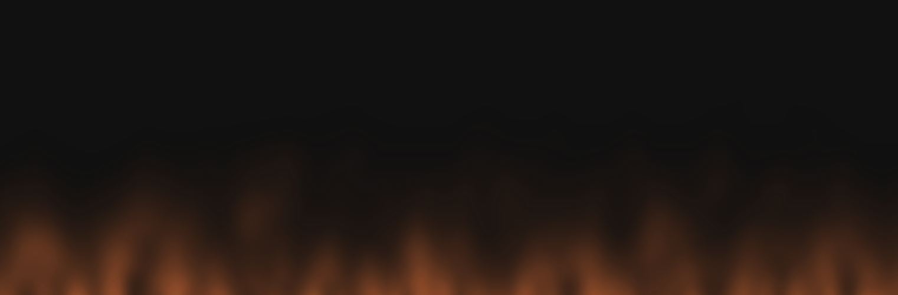

# Fire

Re-implementation in JavaScript with Canvas, of Fire algorithm I used to do in x86 assembler on DOS
as a kid.

## Prerequisites

* Node.js >= 4 for the webpack build.
* Modern browser to run it in (tested with Opera, Chrome).

## Build, run

```bash
npm install
npm start
```
Then open [http://localhost:8080](http://localhost:8080) in a browser to see the fire burning!

Zoom in to make the fire cover the width of the screen. (It would be too slow to render all pixels
in full resolution.)

